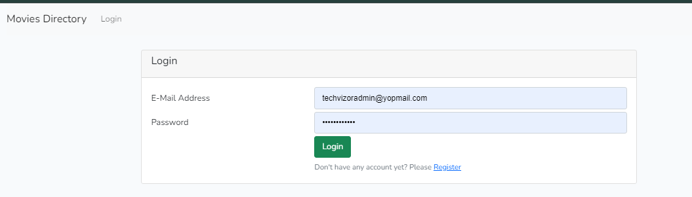
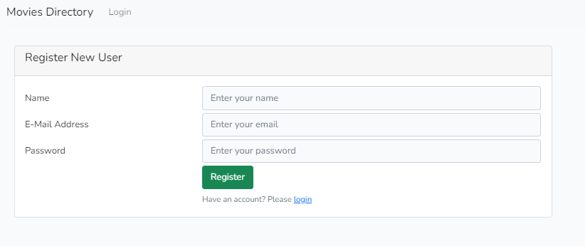
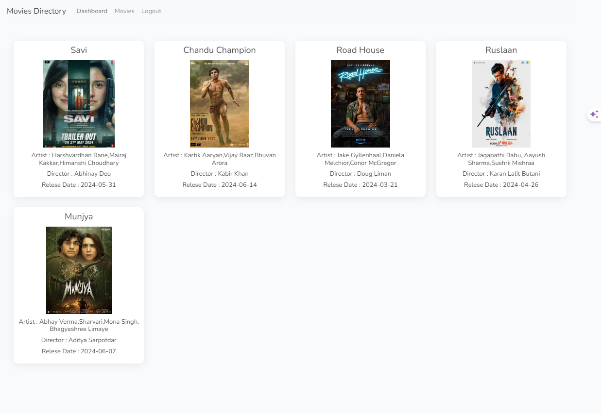
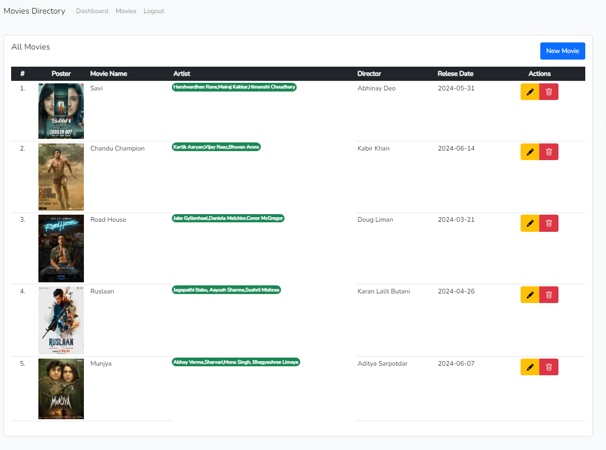
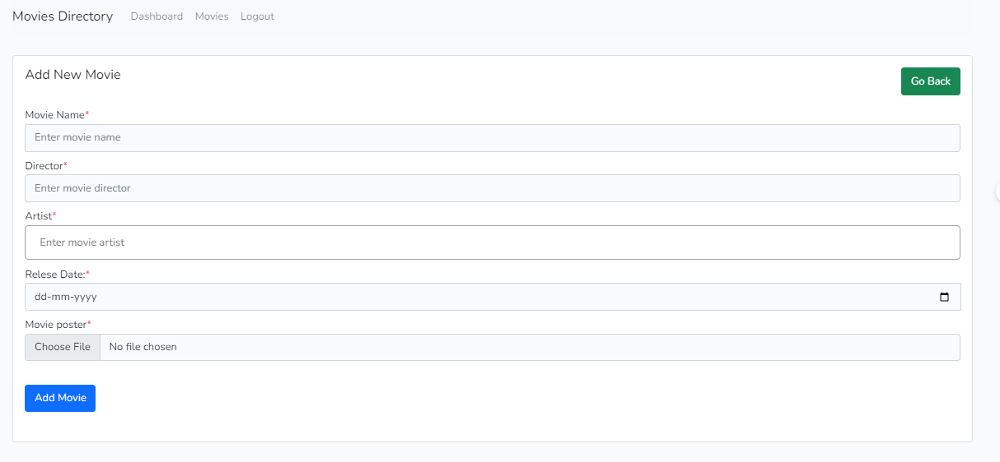

## Login Screen

## Registration Screen

## Dashboard Screen

## Movies Listing Screen

## Movie Create Form 

## Steps to install project
- Run Command ## composer Install ##
- Configure .env file with database credentials and other configurations.
- Run Command ## npm Install 
- Run Command ## npm run dev
- Run Command ## php artisan migrate --seed
- Run Command ## php artisan serve
- Run Command ## php artisan key:generate
- Make Seeder and add admin record first to insert the Data.

## Note
- Before Run migrate command create first database.sqlite file in Database folder
